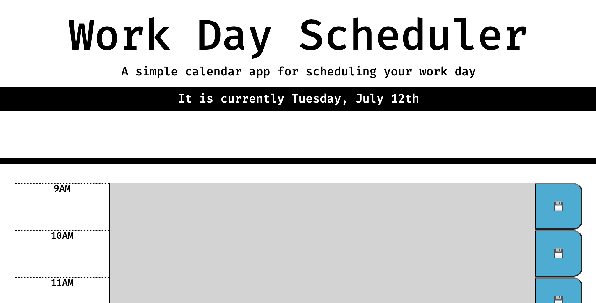
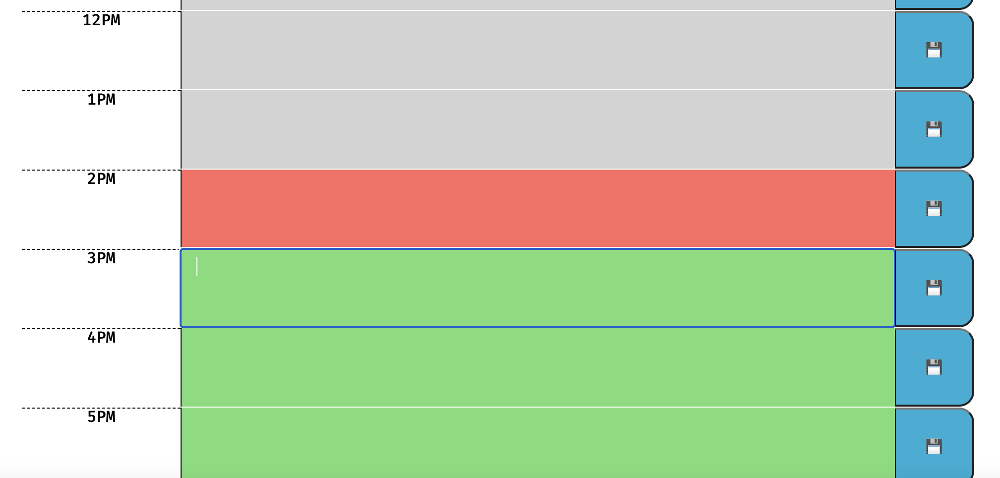

## Work Day Scheduler
With this application, an individual is able to log events in a daily planner that will be color coded to indicate past, present and future. 

## User Story

AS AN employee with a busy schedule
I WANT to add important events to a daily planner
SO THAT I can manage my time effectively

## Description

In this application, a user is presented with a daily scheduler which will help let them input tasks and plan their day accordingly. Each hour is color-coded, with gray representing tasks in the past, red as the current hour and green as any future hours. Even if the user leaves the page or refreshes it, the tasks will still remain. 

## Screenshot of Deployed Application

This image shows the Work Day Scheduler with the current date. 

This image shows the color-coding of time blocks to indicate past, present and future. 

## Link to Deployed Application
GitHub: 

## Contact Info
Frank Winkler III
 
GitHub : https://github.com/FWinkler3 
 
Email: frank.w.winkler@gmail.com 
